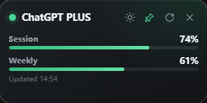

# Codex Card

> A tiny, always-on-top desktop card for monitoring your ChatGPT Codex usage.

Codex Card keeps the two Codex rate-limit windows visible without adding a
dashboard, account setup, or other distractions. It reads your existing Codex
CLI login locally and displays the current session and weekly usage percentages
in a compact Tauri window.

## Preview

| Light | Dark |
| --- | --- |
|  |  |

## Features

- **Focused by design**: displays only the 5-hour session and 7-day weekly
  usage windows.
- **Desktop friendly**: always on top, frameless, transparent, fixed-size, and
  hidden from the taskbar.
- **Easy to position**: drag the card from its header to place it anywhere on
  your desktop.
- **Automatic updates**: refreshes usage every 60 seconds, with a manual refresh
  button when needed.
- **Local credentials**: uses the existing Codex CLI credentials in
  `~/.codex/auth.json`; no token entry or separate sign-in flow is required.
- **Small native shell**: built with Rust, Tauri, TypeScript, and Vite.

## How It Works

The Rust backend reads the access token from `~/.codex/auth.json` and requests
Codex usage data from:

```text
https://chatgpt.com/backend-api/wham/usage
```

The access token is never exposed to the webview. Only the plan name and usage
percentages are returned to the interface.

> [!NOTE]
> Codex Card is an unofficial community project and is not affiliated with or
> endorsed by OpenAI. It relies on an internal ChatGPT endpoint that may change
> without notice.

## Prerequisites

- Windows
- A ChatGPT subscription with access to Codex
- A working [Codex CLI](https://github.com/openai/codex) login that has created
  `~/.codex/auth.json`
- [Node.js](https://nodejs.org/) and [pnpm](https://pnpm.io/)
- [Rust](https://www.rust-lang.org/tools/install) and the
  [Tauri prerequisites](https://v2.tauri.app/start/prerequisites/)

## Quick Start

```powershell
git clone https://github.com/lrkkr/codex-card.git
cd codex-card
pnpm install
pnpm tauri dev
```

## Build

Create a Windows installer:

```powershell
pnpm tauri build
```

The generated installer is written under `src-tauri/target/release/bundle/nsis/`.

## Checks

```powershell
pnpm check
cargo test --manifest-path src-tauri/Cargo.toml
pnpm tauri build
```

## Security

Codex Card reads your local Codex CLI credential only in the Rust backend and
uses it exclusively for the usage request described above. Credentials are not
stored by Codex Card, sent to the frontend, or forwarded to any third-party
service.

As with any application that reads local credentials, review the source and use
builds from a source you trust.

## Acknowledgements

Codex Card was inspired by
[akitaonrails/ai-usagebar](https://github.com/akitaonrails/ai-usagebar) and
reimagined as a deliberately minimal floating card.

## License

Codex Card is licensed under the [GNU General Public License v3.0](LICENSE).
